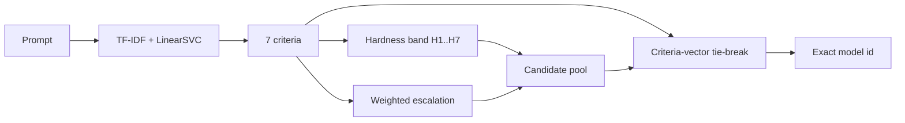

# SVC Middleware

Python request middleware that routes a prompt to an exact model id for the proxy.

## What It Does

The middleware loads a bundled sklearn artifact and performs:

1. prompt -> 7 Arena-Hard criteria
2. criteria -> hardness band `H1..H7`
3. criteria -> weighted escalation class
4. `(H-band, escalation)` -> candidate model pool
5. criteria-vector tie-break -> exact model

The response contract is:

```json
{ "model": "gpt-5.4-2026-03-05" }
```

Unlike the binary `small` / `large` middleware variants, this router resolves the final concrete model inside the middleware itself.

## Routing Flow



## Criteria

- `specificity`
- `domain_knowledge`
- `complexity`
- `problem_solving`
- `creativity`
- `technical_accuracy`
- `real_world`

## Training Data

The bundled classifier was trained from the public [lmarena-ai/arena-human-preference-140k](https://huggingface.co/datasets/lmarena-ai/arena-human-preference-140k) dataset.

Preparation choices used for this artifact:

- language: English only
- code prompts: excluded
- rows with `winner = both_bad`: excluded
- raw rows kept: `41,657`
- deduplicated prompt rows used: `34,793`

The training target is the 7-criteria prompt annotation, not the model-vs-model winner label.

## Model Artifact

The bundled artifact in [`models/model.joblib`](models/model.joblib) is a multilabel sklearn classifier with:

- word TF-IDF features
  - analyzer: `word`
  - ngrams: `1-2`
  - `min_df=2`
  - `max_features=100000`
- character TF-IDF features
  - analyzer: `char_wb`
  - ngrams: `3-5`
  - `min_df=2`
  - `max_features=75000`
- classifier
  - `OneVsRestClassifier`
  - base estimator: `LinearSVC`
  - `C=0.5`
  - `class_weight="balanced"`
  - `dual="auto"`
  - `random_state=42`

In short:

```text
prompt -> word TF-IDF + char TF-IDF -> 7 binary criteria
```

## Runtime Scoring

After criteria prediction, the middleware performs two routing steps:

1. **Hardness band**
   - `hardness_score = sum(criteria)`
   - banded to `H1..H7`
   - zero is clamped to `H1`

2. **Weighted escalation**
   - criterion weights:
     - `specificity = 0.10`
     - `domain_knowledge = 0.15`
     - `complexity = 0.25`
     - `problem_solving = 0.18`
     - `creativity = 0.07`
     - `technical_accuracy = 0.18`
     - `real_world = 0.07`
   - thresholds:
     - `< 0.34 -> small_ok`
     - `< 0.64 -> mid_needed`
     - otherwise `strong_needed`

The middleware then:

- selects the candidate pool for `(H-band, escalation)`
- scores the candidates using model traits from the registry
- applies a criteria-vector tie-break
- returns the best exact model id

This logic is configured in:

- [`config/svc_middleware_mapping.website_connections.json`](config/svc_middleware_mapping.website_connections.json)
- [`config/router_registry.website_connections.json`](config/router_registry.website_connections.json)

## Metrics Snapshot

The current bundled SVC artifact was chosen as the best lightweight classical model from the training runs.

Reference metrics for that artifact:

- criteria micro-F1: `0.7724`
- criteria macro-F1: `0.7614`
- exact 7-label match: `0.2237`
- hardness MAE: `1.2769`
- weighted escalation MAE: `0.1969`
- weighted escalation accuracy: `0.5872`

This should be read as:

- reasonably strong multilabel prompt classification for a lightweight model
- good enough to support production exact-model routing
- still interpretable and cheap compared with a second LLM call

## Files

- entrypoint: [`index.py`](index.py)
- router logic: [`classifier.py`](classifier.py)
- mapping config: [`config/svc_middleware_mapping.website_connections.json`](config/svc_middleware_mapping.website_connections.json)
- model registry: [`config/router_registry.website_connections.json`](config/router_registry.website_connections.json)
- bundled artifact: [`models/model.joblib`](models/model.joblib)
- container build: [`Dockerfile`](Dockerfile)

## Endpoints

- `POST /api/v1/classify`
- `GET /health`
- `GET /ready`
- `POST /api/v1/classify/debug` when `SVC_ENABLE_DEBUG_ENDPOINTS=true`

## Run Locally

```bash
python classifier/packages/svc-middleware/index.py
```

Default port:

```text
3004
```
