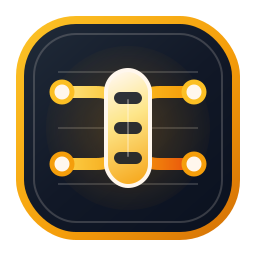

# llmproxy



`llmproxy` is an OpenAI-compatible proxy and load balancer for local or
self-hosted LLM backends. It combines the proxy API, dashboard, diagnostics,
and an MCP server endpoint in a layered Nuxt and Nitro workspace.

## Workspace Architecture

This repository is structured as a host app plus reusable lower-level apps under
[`apps/README.md`](apps/README.md).

The short version:

- `llmproxy` is the host product app
- `ai-request-middleware` provides a parsed-request middleware hook for model routing decisions
- `ai-client` / `ai-proxy` / `ai-server` split backend connectivity, orchestration, and HTTP surface
- `mcp-client` / `mcp-server` split outbound and inbound MCP concerns
- infrastructure apps like `config`, `otel`, `ajv`, `sse`, and `tool-registry` stay reusable

Cross-app imports are expected to go through app public surfaces or `shared`, not
through another app's `server/services/*`, `server/utils/*`, or frontend
internals such as `app/utils/*`. For reusable browser helpers, apps should
publish a top-level `*-client.ts` surface.

The shared app guide also defines the distinction between `*-capability.ts` and
`*-runtime.ts`, so new layers use the same public-surface pattern consistently.

## Features

- OpenAI-compatible forwarding for `POST /v1/chat/completions`
- Aggregated `GET /v1/models`
- Load balancing across multiple backends with `maxConcurrency`
- Queueing when local backends are fully utilized
- Dashboard under `/dashboard` with live status, request inspection,
  playground, configuration, and diagnostics
- Built-in connectors for `openai`, `llama.cpp`, and `ollama`
- Built-in MCP server endpoint under `POST /mcp`
- Separate `mcp-client` layer for outbound MCP integrations
- Optional OTLP trace export with OpenTelemetry GenAI semantic-convention spans
- Parsed-request middleware hook that can delegate model selection to external systems

## Supported Routes

- `GET /v1/models`
- `POST /v1/chat/completions`

Other OpenAI-style routes such as `POST /v1/completions`,
`POST /v1/responses`, `POST /v1/embeddings`, audio routes, or image routes
are currently not implemented and return `501`.

## Getting Started

Requirements:

- Node.js `^20.19.0 || >=22.12.0`
- npm

Install dependencies:

```bash
npm install
```

Start development mode:

```bash
npm run dev
```

Build for production:

```bash
npm run build
```

Start the production build locally:

```bash
npm start
```

After startup:

- Proxy API: `http://localhost:3000/v1/...`
- Dashboard: `http://localhost:3000/dashboard`
- Requests: `http://localhost:3000/dashboard/logs`
- Playground: `http://localhost:3000/dashboard/playground`
- Diagnostics: `http://localhost:3000/dashboard/diagnostics`
- Config: `http://localhost:3000/dashboard/config`

To use a different local host or port, set the standard Nuxt or Nitro
environment variables such as `HOST`, `PORT`, `NUXT_HOST`, `NUXT_PORT`,
`NITRO_HOST`, or `NITRO_PORT` before starting the app.

Every completed or rejected request is also emitted as one NDJSON line on
`stdout`.

## Docker

Build the image:

```bash
docker build -t llmproxy .
```

Run the container:

```bash
docker run --rm -p 4100:4100 -v llmproxy-data:/data llmproxy
```

Inside the container, `DATA_DIR` defaults to `/data`, so the persisted
AI backend config lives at `DATA_DIR/config/ai-client/config.json`, which
resolves to `/data/config/ai-client/config.json` there. Outbound MCP client
registrations live separately at `DATA_DIR/config/mcp-client/config.json`.
Missing config files are created automatically on first startup.

## Tests

Run the regular test suite:

```bash
npm test
```

Run type checking:

```bash
npm run typecheck
```

Verify the production build:

```bash
npm run build
```

Run stress and soak tests:

```bash
npm run test:memory
npm run test:chaos-memory
npm run test:streams-500
```

## Configuration

By default, `DATA_DIR` resolves to `.data` locally. The `ai-client` app stores
backend and runtime settings under `DATA_DIR/config/ai-client/config.json`,
which resolves to `.data/config/ai-client/config.json`. Set `DATA_DIR` to move
that base directory. If no config file exists yet, it is created automatically
on first start with default values.

Outbound MCP client registrations are stored separately under
`DATA_DIR/config/mcp-client/config.json`. Those entries are owned by the
`mcp-client` app and can be changed through the `llmproxy` admin API.

Optional OpenTelemetry trace export is configured separately under
`DATA_DIR/config/otel/config.json`. When enabled, the `ai-client` exports final
request results as OpenTelemetry client spans with GenAI semantic-convention
attributes.

Each app also provides an external `config.schema.json` file in its app root.
The `config` app aggregates those schemas at `GET /api/config/schema` and uses
them to validate persisted config writes.

Important fields:

- `recentRequestLimit`: number of request entries retained in memory, default
  `1000`
- `baseUrl`: upstream backend URL
- `connector`: `openai`, `llama.cpp`, or `ollama`
- `maxConcurrency`: concurrent requests allowed per backend
- `models`: optional model allowlist such as `["*"]` or `["llama-*"]`
- `healthPath`: optional backend health endpoint
- `apiKey` or `apiKeyEnv`: optional upstream authentication
- `timeoutMs`: optional per-backend request timeout
- `monitoringTimeoutMs`: optional health-check timeout
- `monitoringIntervalMs`: optional health-check interval

Backend changes become active immediately. Server configuration values
`requestTimeoutMs`, `queueTimeoutMs`, `healthCheckIntervalMs`, and
`recentRequestLimit` also apply immediately.

Model-routing middleware is owned separately by the `ai-request-middleware`
app. It only runs when the request explicitly uses a model selector of the form
`middleware:<id>`. The selected middleware runs after the proxy request body
was parsed but before `ai-client` acquires a concrete connection. Concrete
routing middleware implementations are expected to live in separate apps and
register through that app's Nitro capability.

The MCP endpoint is configured by the `mcp-server` app itself through Nuxt
runtime config. Set `private.mcpEnabled` in the `mcp-server` layer runtime
config, for example via `NUXT_PRIVATE_MCP_ENABLED=false`, if you want to
disable `/mcp`.

## Notes

- Requests are buffered so routing can use the requested `model`.
- If the client does not request streaming, `llmproxy` still streams upstream
  internally and returns a normal JSON response at the end.
- `connector: "openai"` strips non-standard sampler fields such as `top_k`,
  `min_p`, and `repeat_penalty`.
- `connector: "llama.cpp"` preserves those fields on the OpenAI-compatible
  route surface.
- `connector: "ollama"` translates requests to native Ollama routes such as
  `/api/chat` and `/api/tags`.

A short technical overview of routing, connectors, retention, and configuration
behavior is available in
[apps/llmproxy/docs/architecture.md](apps/llmproxy/docs/architecture.md).
