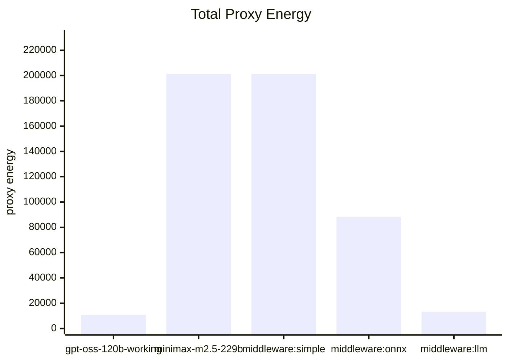
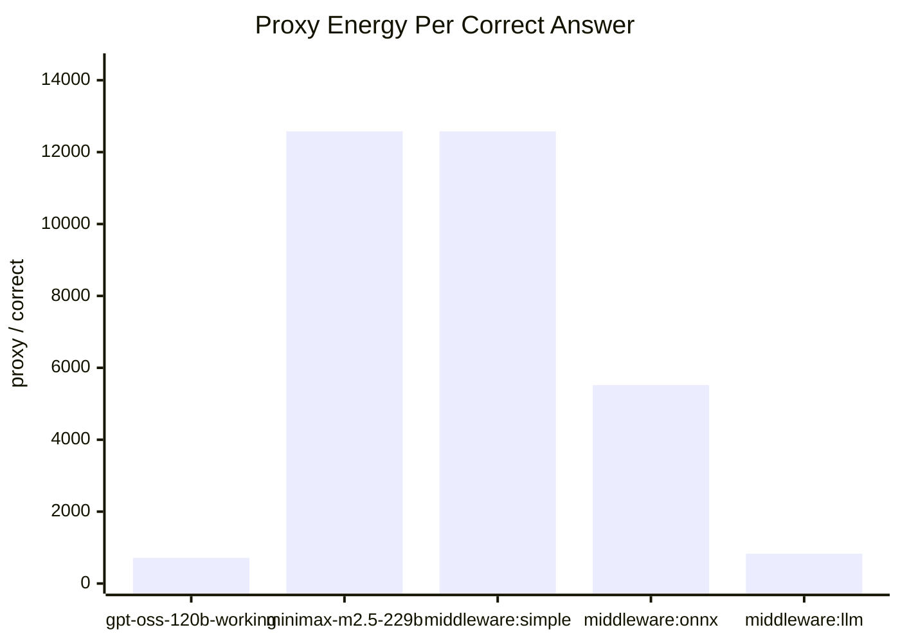

# Energy Proxy Report

- Source comparison: `/Users/marbaced/tmp/cfhack2026/frugal-code/evaluation_data/evaluation_dataset_highScattered.csv`
- Rows evaluated: **30**
- Token unit weight: **1**
- Duration unit weight: **0.001** proxy units per ms
- Current note: this run uses diagnostics-backed output tokens plus wall-clock duration.

## Formula

```text
load_units = total_tokens * tokenUnitWeight + duration_ms * durationMsUnitWeight
proxy_energy = load_units * model_factor(selected_model) * middleware_multiplier(entity)
```

## Model Factors

- `gpt-oss-120b-working`: 1
- `minimax-m2.5-229b`: 3

## Middleware Multipliers

- `direct`: 1
- `middleware:simple`: 1
- `middleware:onnx`: 1.2
- `middleware:llm`: 1.1
- `middleware:vs`: 1.1
- `middleware:svc`: 1.1

## Proxy Scoreboard

| Entity | Kind | Accuracy | Total Proxy Energy | Proxy / Row | Proxy / Correct |
| --- | --- | ---: | ---: | ---: | ---: |
| `gpt-oss-120b-working` | direct | 50.00% | 10715.04 | 357.17 | 714.34 |
| `minimax-m2.5-229b` | direct | 53.33% | 201222.16 | 6707.41 | 12576.38 |
| `middleware:simple` | middleware | 53.33% | 201222.16 | 6707.41 | 12576.38 |
| `middleware:onnx` | middleware | 53.33% | 88335.58 | 2944.52 | 5520.97 |
| `middleware:llm` | middleware | 53.33% | 13311.50 | 443.72 | 831.97 |

## Total Proxy Energy



## Proxy Energy Per Correct Answer



### gpt-oss-120b-working

- Selected models: `gpt-oss-120b-working` (30)
- Total proxy energy: 10715.04
- Proxy energy per correct answer: 714.34

### minimax-m2.5-229b

- Selected models: `minimax-m2.5-229b` (30)
- Total proxy energy: 201222.16
- Proxy energy per correct answer: 12576.38

### middleware:simple

- Selected models: `minimax-m2.5-229b` (30)
- Total proxy energy: 201222.16
- Proxy energy per correct answer: 12576.38

### middleware:onnx

- Selected models: `gpt-oss-120b-working` (15), `minimax-m2.5-229b` (15)
- Total proxy energy: 88335.58
- Proxy energy per correct answer: 5520.97

### middleware:llm

- Selected models: `gpt-oss-120b-working` (29), `minimax-m2.5-229b` (1)
- Total proxy energy: 13311.50
- Proxy energy per correct answer: 831.97
