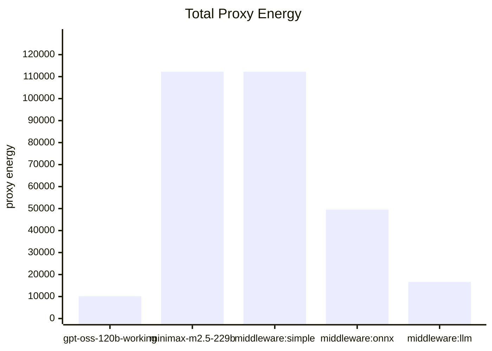
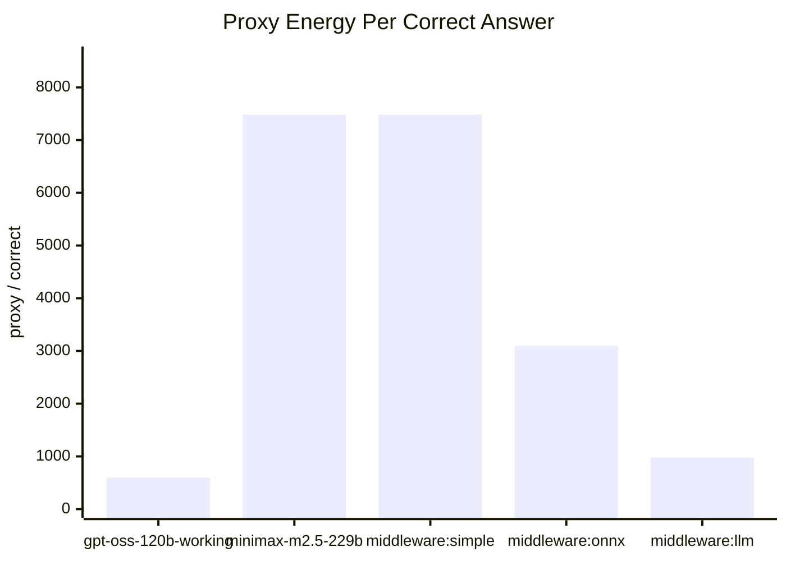

# Energy Proxy Report

- Source comparison: `/Users/marbaced/tmp/cfhack2026/frugal-code/evaluation_data/evaluation_dataset_highScattered.csv`
- Rows evaluated: **30**
- Token unit weight: **1**
- Duration unit weight: **0.001** proxy units per ms
- Current note: this run uses diagnostics-backed output tokens plus wall-clock duration.

## Formula

```text
load_units = total_tokens * tokenUnitWeight + duration_ms * durationMsUnitWeight
proxy_energy = load_units * model_factor(selected_model) * middleware_multiplier(entity)
```

## Model Factors

- `gpt-oss-120b-working`: 1
- `minimax-m2.5-229b`: 3

## Middleware Multipliers

- `direct`: 1
- `middleware:simple`: 1
- `middleware:onnx`: 1.2
- `middleware:llm`: 1.1

## Proxy Scoreboard

| Entity | Kind | Accuracy | Total Proxy Energy | Proxy / Row | Proxy / Correct |
| --- | --- | ---: | ---: | ---: | ---: |
| `gpt-oss-120b-working` | direct | 56.67% | 10132.14 | 337.74 | 596.01 |
| `minimax-m2.5-229b` | direct | 50.00% | 112231.47 | 3741.05 | 7482.10 |
| `middleware:simple` | middleware | 50.00% | 112231.47 | 3741.05 | 7482.10 |
| `middleware:onnx` | middleware | 53.33% | 49564.80 | 1652.16 | 3097.80 |
| `middleware:llm` | middleware | 56.67% | 16641.35 | 554.71 | 978.90 |

## Total Proxy Energy



## Proxy Energy Per Correct Answer



### gpt-oss-120b-working

- Selected models: `gpt-oss-120b-working` (30)
- Total proxy energy: 10132.14
- Proxy energy per correct answer: 596.01

### minimax-m2.5-229b

- Selected models: `minimax-m2.5-229b` (30)
- Total proxy energy: 112231.47
- Proxy energy per correct answer: 7482.10

### middleware:simple

- Selected models: `minimax-m2.5-229b` (30)
- Total proxy energy: 112231.47
- Proxy energy per correct answer: 7482.10

### middleware:onnx

- Selected models: `gpt-oss-120b-working` (15), `minimax-m2.5-229b` (15)
- Total proxy energy: 49564.80
- Proxy energy per correct answer: 3097.80

### middleware:llm

- Selected models: `gpt-oss-120b-working` (29), `minimax-m2.5-229b` (1)
- Total proxy energy: 16641.35
- Proxy energy per correct answer: 978.90
