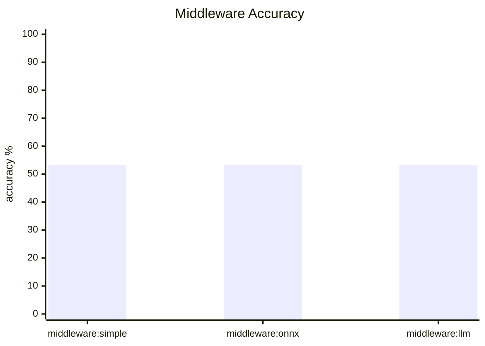
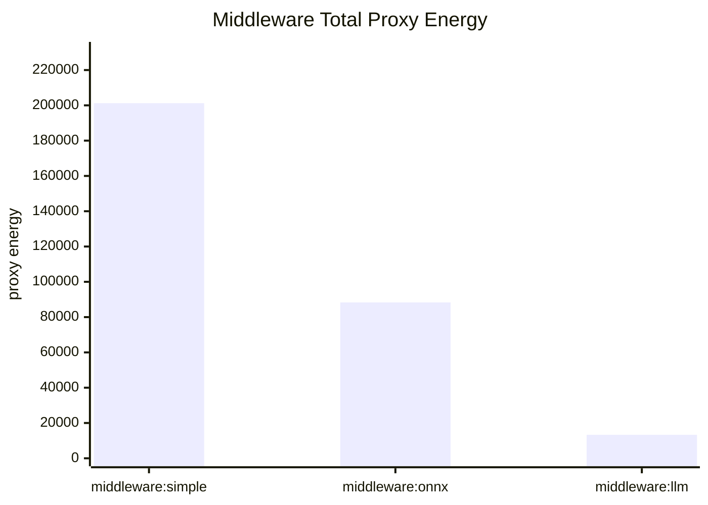
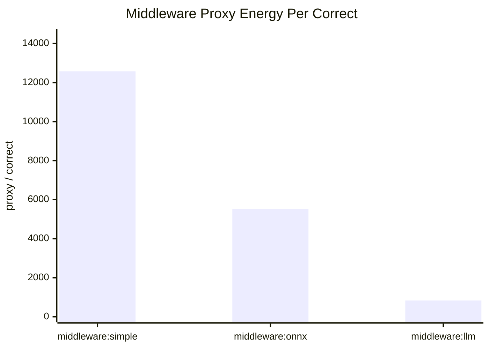

# Middleware Summary

- Dataset: `/Users/marbaced/tmp/cfhack2026/frugal-code/evaluation_data/evaluation_dataset_highScattered.csv`
- Rows evaluated: **30**
- Small model factor: `gpt-oss-120b-working` = 1
- Large model factor: `minimax-m2.5-229b` = 3

## Most Interesting Takeaways

- Best middleware by accuracy: `middleware:simple` at 53.33% (16/30).
- Best middleware by proxy energy per correct answer: `middleware:llm` at 831.97.
- Most expensive middleware overall: `middleware:simple` at 201222.16 proxy units.

## Middleware Scoreboard

| Middleware | Accuracy | Correct | Completion Tokens | Reasoning Tokens | Avg Duration (ms) | Proxy Energy | Proxy / Correct |
| --- | ---: | ---: | ---: | ---: | ---: | ---: | ---: |
| `middleware:simple` | 53.33% | 16/30 | 64438 | 64380 | 87868.4 | 201222.16 | 12576.38 |
| `middleware:onnx` | 53.33% | 16/30 | 29230 | 29187 | 9787.9 | 88335.58 | 5520.97 |
| `middleware:llm` | 53.33% | 16/30 | 10669 | 10638 | 3483.5 | 13311.50 | 831.97 |

## Accuracy

## Total Proxy Energy

## Proxy Energy Per Correct Answer

## Routing Details

### middleware:simple

- Routed backends: `minimax-m2.5-229b` (30)
- Accuracy: 53.33% (16/30)
- Output tokens: 64438 total, 64380 reasoning, 58 answer
- Average duration: 87868.4 ms
- Proxy energy: 201222.16 total, 12576.38 per correct answer
- Agreement with direct models: small 18/30, large 29/30

### middleware:onnx

- Routed backends: `gpt-oss-120b-working` (15), `minimax-m2.5-229b` (15)
- Accuracy: 53.33% (16/30)
- Output tokens: 29230 total, 29187 reasoning, 43 answer
- Average duration: 9787.9 ms
- Proxy energy: 88335.58 total, 5520.97 per correct answer
- Agreement with direct models: small 25/30, large 22/30

### middleware:llm

- Routed backends: `gpt-oss-120b-working` (29), `minimax-m2.5-229b` (1)
- Accuracy: 53.33% (16/30)
- Output tokens: 10669 total, 10638 reasoning, 31 answer
- Average duration: 3483.5 ms
- Proxy energy: 13311.50 total, 831.97 per correct answer
- Agreement with direct models: small 29/30, large 19/30
