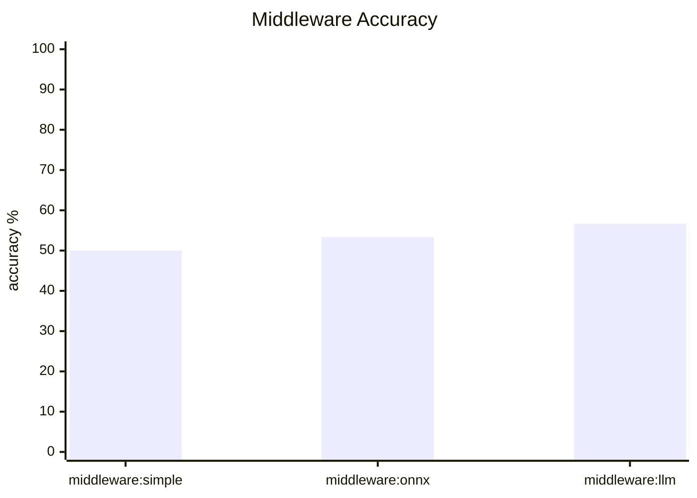
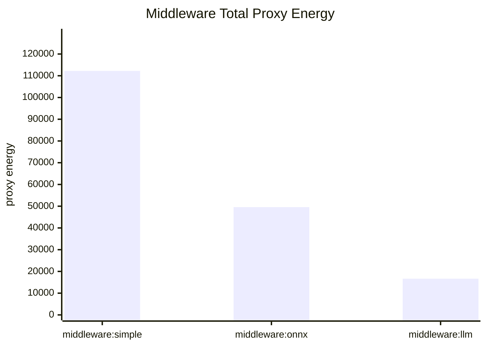
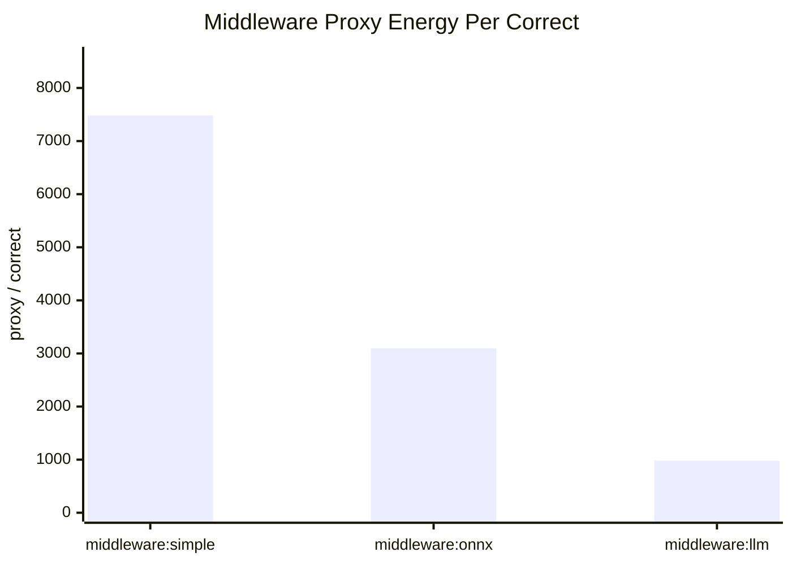

# Middleware Summary

- Dataset: `/Users/marbaced/tmp/cfhack2026/frugal-code/evaluation_data/evaluation_dataset_highScattered.csv`
- Rows evaluated: **30**
- Small model factor: `gpt-oss-120b-working` = 1
- Large model factor: `minimax-m2.5-229b` = 3

## Most Interesting Takeaways

- Best middleware by accuracy: `middleware:llm` at 56.67% (17/30).
- Best middleware by proxy energy per correct answer: `middleware:llm` at 978.90.
- Most expensive middleware overall: `middleware:simple` at 112231.47 proxy units.

## Middleware Scoreboard

| Middleware | Accuracy | Correct | Completion Tokens | Reasoning Tokens | Avg Duration (ms) | Proxy Energy | Proxy / Correct |
| --- | ---: | ---: | ---: | ---: | ---: | ---: | ---: |
| `middleware:simple` | 50.00% | 15/30 | 37026 | 36966 | 12816.3 | 112231.47 | 7482.10 |
| `middleware:onnx` | 53.33% | 16/30 | 17956 | 17911 | 6180.1 | 49564.80 | 3097.80 |
| `middleware:llm` | 56.67% | 17/30 | 10904 | 10873 | 3837.3 | 16641.35 | 978.90 |

## Accuracy

## Total Proxy Energy

## Proxy Energy Per Correct Answer

## Routing Details

### middleware:simple

- Routed backends: `minimax-m2.5-229b` (30)
- Accuracy: 50.00% (15/30)
- Output tokens: 37026 total, 36966 reasoning, 60 answer
- Average duration: 12816.3 ms
- Proxy energy: 112231.47 total, 7482.10 per correct answer
- Agreement with direct models: small 21/30, large 30/30

### middleware:onnx

- Routed backends: `gpt-oss-120b-working` (15), `minimax-m2.5-229b` (15)
- Accuracy: 53.33% (16/30)
- Output tokens: 17956 total, 17911 reasoning, 45 answer
- Average duration: 6180.1 ms
- Proxy energy: 49564.80 total, 3097.80 per correct answer
- Agreement with direct models: small 29/30, large 22/30

### middleware:llm

- Routed backends: `gpt-oss-120b-working` (29), `minimax-m2.5-229b` (1)
- Accuracy: 56.67% (17/30)
- Output tokens: 10904 total, 10873 reasoning, 31 answer
- Average duration: 3837.3 ms
- Proxy energy: 16641.35 total, 978.90 per correct answer
- Agreement with direct models: small 30/30, large 21/30
